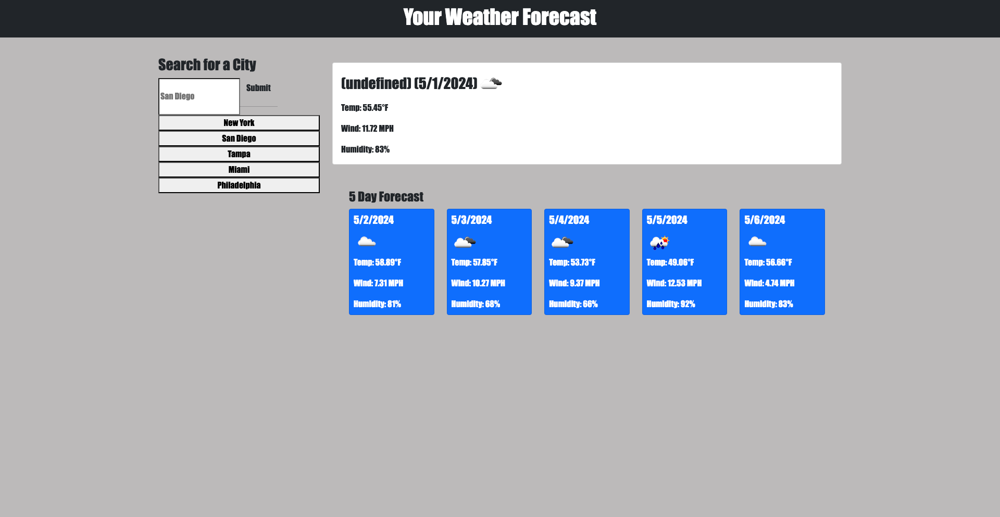

# your-weather-forecast

=================

## Description

    Your Weather Forecast has a city search form that allows you to input of the city of your choice to get the 5 day weather forecast. After each city search the data is stored in local storage and displayed as a button within the form. When you click each button it should display the 5 day forecast of that particular city. 

## Finished Product 

## Languages

- 
- 
- 
- 

## Credits

- Used this blog to get started with generating my API key and starter code to create variables to store OpenWeather's current weather data
    - **<https://coding-boot-camp.github.io/full-stack/apis/how-to-use-api-keys>**

- Used icons from this website under usage
    - **<https://icons8.com/>**
 
## License

MIT see more details in repo

## Live Link

<https://joegruff16.github.io/your-weather-forecast/>

## GitHub Repo

<https://github.com/joegruff16/your-weather-forecast>